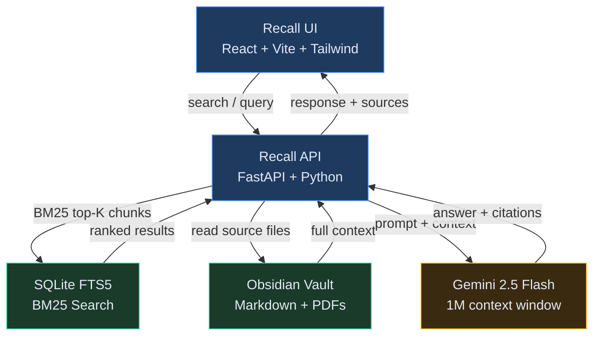

# Recall 🧠

Your personal knowledge system. Search meeting transcripts, notes, decisions, and PDFs with AI-powered retrieval.

> *"What did we decide about X?" — answered in seconds.*

## Features

- **Web UI** — Clean, Obsidian-inspired interface for search and browsing
- **BM25 Search** — Fast keyword search via SQLite FTS5
- **RAG Answers** — Natural language questions answered with source citations
- **Clickable Sources** — Inline citations link directly to original notes
- **Name-Aware Search** — Detects person names and boosts relevant 1:1 notes
- **Two RAG Modes** — Chunk-based (fast) or full-context (best quality)
- **PDF Support** — Index PDFs alongside markdown notes
- **No GPU Required** — Runs entirely on CPU

## Architecture



**Query flow:**

```
vectorless mode:  Query → BM25 (FTS5) → top-50 chunks → Gemini → Answer + citations
fullcontext mode: Query → BM25 (FTS5) → source files → Gemini (1M ctx) → Answer + citations
```

## Search Modes

| Mode | Context | Speed | Quality | Description |
|------|---------|-------|---------|-------------|
| `vectorless` | ~7K tokens | ~20s | Good | BM25 top-50 chunks → Gemini |
| `fullcontext` | ~100K tokens | ~25s | Best | Full source files → Gemini |

## Quick Start

### Prerequisites

- Docker (or Kubernetes)
- Gemini API key ([get one here](https://aistudio.google.com/apikey))
- Markdown files to index (Obsidian vault, Granola transcripts, etc.)

### Setup

1. Clone and configure:

```bash
git clone https://github.com/arniesaha/recall.git
cd recall/services
cp .env.example .env
# Edit .env: set API_TOKEN and GEMINI_API_KEY
```

2. Start services:

```bash
docker compose up -d
```

3. Index your documents:

```bash
curl -X POST http://localhost:8080/index/start \
  -H "Authorization: Bearer $API_TOKEN" \
  -H "Content-Type: application/json" \
  -d '{"vault": "all", "full": true}'
```

4. Start the UI:

```bash
cd ui
cp .env.example .env.local  # Set VITE_API_TOKEN
npm install && npm run dev
```

## API Endpoints

### Search

```bash
curl -X POST http://localhost:8080/search \
  -H "Authorization: Bearer $API_TOKEN" \
  -H "Content-Type: application/json" \
  -d '{"query": "project timeline", "limit": 10}'
```

### RAG Query

```bash
# Chunk-based (fast, default)
curl -X POST http://localhost:8080/query/vectorless \
  -H "Authorization: Bearer $API_TOKEN" \
  -H "Content-Type: application/json" \
  -d '{"question": "What did we decide about the API redesign?", "mode": "vectorless"}'

# Full-context (best quality)
curl -X POST http://localhost:8080/query/vectorless \
  -H "Authorization: Bearer $API_TOKEN" \
  -H "Content-Type: application/json" \
  -d '{"question": "Summarize all discussions with Sarah", "mode": "fullcontext"}'
```

### 1:1 Prep

```bash
curl http://localhost:8080/prep/PersonName \
  -H "Authorization: Bearer $API_TOKEN"
```

### Health Check

```bash
curl http://localhost:8080/health
```

## Web UI

The React-based UI connects to the API and provides:

- Dark mode by default (Obsidian-inspired)
- AI answers with **clickable source citations**
- File tree browsing
- Note viewer with markdown rendering
- Mobile-friendly responsive design
- Keyboard shortcuts (`/` to search, `Escape` to close)

```bash
cd ui
npm install
npm run dev         # Development
npm run build       # Production build
```

## Key Algorithms

### Name-Aware BM25 Boosting

When queries mention person names, Recall:

- Runs dual BM25 search (name-only + full query)
- Boosts 1:1 meeting notes with that person (3x)
- Boosts titled notes mentioning the person (1.5x)
- Penalizes raw transcripts (0.8x)

### Inline Source Linking

Gemini's source citations like `(Source 1, 3: "Meeting Title")` are automatically parsed and converted into clickable links that navigate to the original note.

### Temporal Query Parsing

Natural language date expressions are resolved:

- "last week" → date range filter
- "this month" → date range filter
- "in January" → month filter

## Configuration

| Variable | Required | Description |
|----------|----------|-------------|
| `API_TOKEN` | Yes | API authentication token |
| `GEMINI_API_KEY` | Yes | Google Gemini API key |
| `VECTORLESS_GEMINI_MODEL` | No | Gemini model (default: `gemini-2.5-flash`) |
| `VECTORLESS_LLM_BACKEND` | No | LLM backend: `gemini` or `openclaw` |
| `VAULT_WORK_PATH` | No | Work vault path (default: `/data/obsidian/work`) |
| `VAULT_PERSONAL_PATH` | No | Personal vault path (default: `/data/obsidian/personal`) |
| `VECTORLESS_MAX_CONTEXT_CHARS` | No | Max context for fullcontext mode (default: 400K) |
| `VECTORLESS_BM25_TOP_K` | No | BM25 results for vectorless mode (default: 50) |

## Project Structure

```
recall/
├── services/
│   └── api/
│       ├── main.py          # FastAPI application
│       ├── vectorless.py    # BM25 search + Gemini RAG
│       ├── indexer.py       # FTS document indexing
│       ├── fts_index.py     # SQLite FTS5 wrapper
│       ├── temporal.py      # Date expression parsing
│       ├── config.py        # Settings
│       └── Dockerfile
├── ui/                       # React frontend
│   ├── src/
│   │   ├── components/      # React components
│   │   ├── pages/           # Route pages
│   │   ├── api/             # API client
│   │   └── hooks/           # Custom hooks
│   ├── package.json
│   └── Dockerfile
├── helm/                     # Kubernetes deployment
│   ├── templates/
│   └── values.example.yaml
├── scripts/                  # Utility scripts
└── docs/                     # Documentation
```

## Kubernetes Deployment

```bash
cd helm
cp values.example.yaml values.yaml
# Edit values.yaml with your config
helm install recall .
```

## License

MIT
